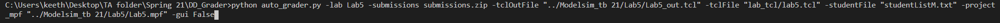

# DD_Grader

How to use:

1. Copy student names into studentList.txt (For students with middle names just use first and last)
2. Download full lab 'submission.zip' from canvas
3. Copy zip file into cloned git folder
4. Copy example command at the bottom of tb_grader.zip
5. Modify command to reflect your project locations and directories
6. Use given 'Modelsim_tb_X' (can be found on Teams) directory for project mpf location.
7. Run command in either GUI enabled or disabled mode

