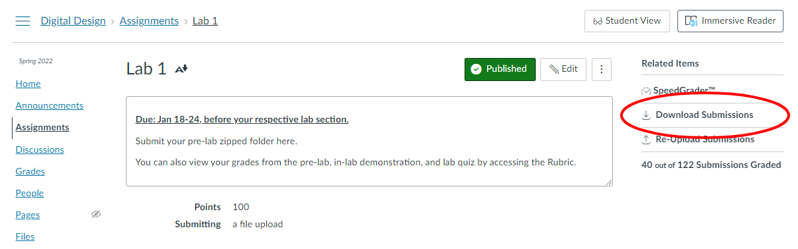

# DD_Grader

An interactive ModelSim testbench runner.

### Table of contents

* Prerequisites
* Usage
* Using the interactive Testbench Runner

# Prerequisites

### 1. ModelSim

Install ModelSim via [this link](https://fpgasoftware.intel.com/20.1/?edition=lite&product=modelsim_ae&platform=windows)

You can verify modelsim is working p roperly by running `vsim -version` in a terminal window. It should print something similar to: 
```bash
$ vsim -version
Model Technology ModelSim - INTEL FPGA STARTER EDITION vsim 2020.1 Simulator 2020.02 Feb 28 2020
$
```

**Note:** DD_Grader has been tested with vsim version **2020.1** and is not guaranteed to work on other versions.

### 2. Python

You can download Python from [this link](https://www.python.org/downloads/).

You can verify Python is working properly by running `python -V` in a terminal window. It should print something similar to:
```bash
$ python -V
Python 3.10.1
$
```

**Note:** DD_Grader has been tested with Python **3.10.1** and is not guaranteed to work on other versions.

# Usage

## Setup Student List

DD_Grader expects a text file with names of the students which it should set up for grading.

Use the same format as [students_example.txt](www.google.com), which is `<FirstName> [Middle name(s)] <LastName>` per line.

Finally, use the default `students.txt` filename, or specify the file path in the CLI args via `--student-list <path>`.

## Download Canvas submissions

On the Canvas Assignment page, press "Download submissions". 



This will collect *all* student submissions and download them in one file titled `submissions.zip`.


Copy `submissions.zip` into the project directory, or specify the zip archive path in the CLI args via `--submissions <path>`.

## Run `autograder.py`

### Example commands:

To run the testbenches for Lab 1 with all default values (a "submissions.zip" folder and a "students.txt" file in the project root directory), run the following command:

```bash
python auto_grader.py --lab Lab1 --tcl-out-file "Modelsim_tb 21/Lab1/Lab1_out.tcl" --tcl-file lab_tcl/lab1.tcl --project-mpf "Modelsim_tb 21/Lab1/Lab1.mpf"
```

To run Lab 5 with the exact same setup, use the following command:

```bash
python auto_grader.py --lab Lab5 --tcl-out-file "Modelsim_tb 21/Lab5/Lab5_out.tcl" --tcl-file lab_tcl/lab5.tcl --project-mpf "Modelsim_tb 21/Lab5/Lab5.mpf"
```

Notice the flags `--lab`, `--tcl-out-file`, `--tcl-file`, and `--project-mpf` all use different file paths representing Lab 5.

## Other options and flags
### GUI

To run the ModelSim GUI, use the `--gui` flag. This will open a ModelSim instance and simulate with ModelSim's waveform window.

### Student List path

To specify a path for the student list text file, use `--student-list <path>`.

### `submissions.zip` path

To specify a path for the submissions.zip file, use `--submissions <path>`.
This can be useful if you want to maintain multiple labs' worth of submissions. You can rename the file to `submissions_lab2.zip` for example, and specify this name in the CLI args.

# Using the Interactive Testbench Runner

After running a command to start the grader, the program will print the students it was able to find in the `submissions.zip` file.
Then, ModelSim will begin running, and a prompt will appear:

> Enter 'q' to exit\
> Enter 'n' for next student\
> Press Control-C to break out if stuck\
> Now working on albertegator Hit Enter to continue ==>

At this point, the user has three options:

* Enter `q` to exit the testbench runner.
* Enter `n` to skip the simulation for the current student.
* Press `Enter` to begin the simulation for the current student.
    * The results of the simulation will be printed to the terminal (or transcript window if running with `--gui`)
    
Once the simulation is complete (or the user enters `n` to skip the student), the prompt will reappear with the next Student's name, until the list of students is exhausted.
