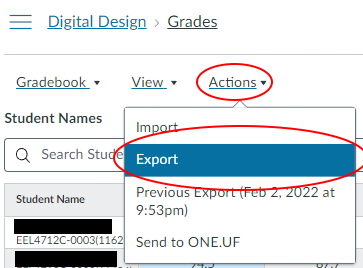

# DD_Grader

An interactive ModelSim testbench runner.

### Table of contents

* [Prerequisites](https://github.com/benjamin051000/DD_Grader#prerequisites)
* [Usage](https://github.com/benjamin051000/DD_Grader#usage)
  * [1. Select Students to Grade]()
  * [2. Download Canvas Submissions]()
  * [3. Run grader.py]()
* [Using the interactive Testbench Runner](https://github.com/benjamin051000/DD_Grader#using-the-interactive-testbench-runner)

# Prerequisites

### 1. ModelSim

Install ModelSim via [this link](https://fpgasoftware.intel.com/20.1/?edition=lite&product=modelsim_ae&platform=windows)

You can verify modelsim is working p roperly by running `vsim -version` in a terminal window. It should print something similar to: 
```bash
$ vsim -version
Model Technology ModelSim - INTEL FPGA STARTER EDITION vsim 2020.1 Simulator 2020.02 Feb 28 2020
```

**Note:** DD_Grader has been tested with vsim version **2020.1** and is not guaranteed to work on other versions.

### 2. Python

You can download Python from [this link](https://www.python.org/downloads/).

You can verify Python is working properly by running `python -V` in a terminal window. It should print something similar to:
```bash
$ python -V
Python 3.10.1
```

**Note:** DD_Grader has been tested with Python **3.10.1** and is not guaranteed to work on other versions.

# Usage
## 1. Select Students to Grade
There are two methods to select students to grade: By section number, or via a list of names.

<details><summary>Select by Section Number</summary>

To use the `--section` flag, a file named `students.csv` must be downloaded to the project directory. This file contains information about students in the course, including each students' section number.
### Download Student Data

1. Navigate to the course gradebook on Canvas.
2. Click "Actions > Export" as shown in the below image.



Save this file as `students.csv` in the root directory (the same directory as this README file). It should be structured similarly to `all_students_example.csv`, but may include additional information, like assignment grades.

When running the grader, use `--section <section number>` to specify a section number you wish to grade. Section numbers are 5-digit numbers seen in the parentheses on a students' section ID string. For example, in the class/section identifier `EEL4712C-0001(11624)`, `11624` is the section number.
</details>
<br/>
<details><summary>Select by Student List</summary>

To choose specific students for grading, make a text file with the students' names.

Use the same format as `students_example.txt`, which is `<FirstName> [Middle name(s)] <LastName>` per line.

Finally, use the default `students.txt` filename, or specify the file path in the CLI args via `--student-list <path>`.
</details>
<br/>

## 2. Download Canvas Submissions

On the Canvas Assignment page, press "Download submissions". 


This will collect *all* student submissions and download them in one file titled `submissions.zip`.


Copy `submissions.zip` into the project directory, or specify the zip archive path in the CLI args via `--submissions <path>`.

## 3. Run `grader.py`

### Example commands:

To run the testbenches for Lab 1 with all default values (a "submissions.zip" folder and a "students.txt" file in the project root directory), run the following command:

```bash
python grader.py --lab Lab1 --tcl-out-file modelsim-projects/Lab1/Lab1_out.tcl --tcl-file tcl-templates/lab1.tcl --project-mpf modelsim-projects/Lab1/Lab1.mpf
```

To run Lab 5 with the exact same setup, use the following command:

```bash
python grader.py --lab Lab5 --tcl-out-file modelsim-projects/Lab5/Lab5_out.tcl --tcl-file tcl-templates/lab5.tcl --project-mpf modelsim-projects/Lab5/Lab5.mpf
```

Notice the flags `--lab`, `--tcl-out-file`, `--tcl-file`, and `--project-mpf` all use different file paths representing Lab 5.

## Other options and flags
### GUI

To run the ModelSim GUI, use the `--gui` flag. This will open a ModelSim instance and simulate with ModelSim's waveform window.

### `submissions.zip` path

To specify a path for the submissions.zip file, use `--submissions <path>`.
This can be useful if you want to maintain multiple labs' worth of submissions. You can rename the file to `submissions_lab2.zip` for example, and specify this name in the CLI args.

# Using the Interactive Testbench Runner

After running a command to start the grader, the program will print the students it was able to find in the `submissions.zip` file.
Then, ModelSim will begin running, and a prompt will appear:

> Enter 'q' to exit\
> Enter 'n' for next student\
> Press Control-C to break out if stuck\
> Now working on albertegator Hit Enter to continue ==>

At this point, the user has three options:

* Enter `q` to exit the testbench runner.
* Enter `n` to skip the simulation for the current student.
* Press `Enter` to begin the simulation for the current student.
    * The results of the simulation will be printed to the terminal (or transcript window if running with `--gui`)

If multiple testbenches are used to grade a particular lab, the simulator will ask the user to press `Enter` to continue on to the next testbench.

Once the simulation is complete (or the user enters `n` to skip the student), the prompt will reappear with the next Student's name, until the list of students is exhausted.
